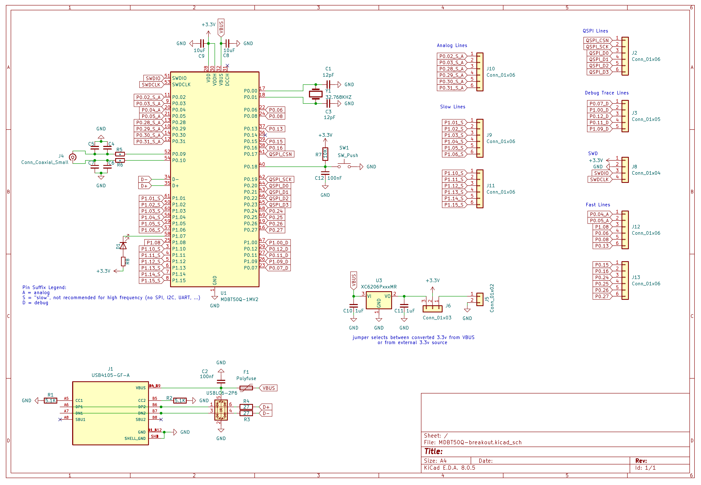

# Raytac MDBT50Q (nRF52840) Breakout Board

> [!WARNING]
> The information and material (code, designs, files, ...) are provided "AS IS". We make no representation or warranty of any kind, express or implied, regarding the accuracy, adequacy, validity, reliability, availability, or completeness of any information or material. Use this at your own risk.

## Introduction

This is a breakout board for the Raytac MDBT50Q, which is small module based on the Nordic nRF52840 microcontroller.

[https://www.raytac.com/product/ins.php?index_id=24](https://www.raytac.com/product/ins.php?index_id=24)

This breakout board works with all three variants, since the only difference is their antenna:

* MDBT50Q-1MV2
* MDBT50Q-U1MV2
* MDBT50Q-P1MV2

Note that these modules are sometimes sold by other vendors, who put their own branding on the module:

* [https://www.adafruit.com/product/4078](https://www.adafruit.com/product/4078)
* [https://www.seeedstudio.com/MDBT50Q-1M-nRF52840-Based-BLE-Module-p-3147.html](https://www.seeedstudio.com/MDBT50Q-1M-nRF52840-Based-BLE-Module-p-3147.html)

This breakout board adds some power management and exposes most of the pins:

> [!WARNING]
> GPIO pins marked as "SLOW IO" are not slow per se. However, Nordic does not recommend using them for high frequency signals (e.g. SPI or I2C), as they may cause, or be subject to, interference (they are closest to the radio of the nRF52840).

## Change Log

* v1.0
  * Initial design 

## Design Considerations

* on-board 5V to 3.3V converter
* external 32.768K crystal (optional for the MDBT50Q module)
* ESD diode 
* reset button
* 1 LED 

## Schematics 

> [!WARNING]
> GPIO pins marked as "SLOW IO" are not slow per se. However, Nordic does not recommend using them for high frequency signals (e.g. SPI or I2C), as they may cause, or be subject to, interference (they are closest to the radio of the nRF52840).

## How to Obtain the Physical PCB

The Gerber file is in this repository (`gerber/MDBT50Q-breakout.zip`). Simply upload this file a PCB manufacturer of your choice (JLPCB, PCBWay, ...), and you they will make it for you for as low as \$5 for 5 pieces (with the cheapest shipping option, which can take a few weeks).

For JLCPCB, select the order number option where they will replace "JLCJLCJLCJLC" on the board with the actual order number.

> [!WARNING]
> Note that will still have to solder the components onto the PCB yourself!

## How to Edit Design

Everything you need to edit this design in KiCad 8 is included in the repository.

However, this project uses symbols, footprints and 3D models from [Component Search Engine](https://componentsearchengine.com/). Their license allows us to do pretty much whatever we want with them, except redistributing them. For this reason I can't include them in this repository.

If you would like to edit the design yourself, you will need to download the following component libraries from [https://componentsearchengine.com/](https://componentsearchengine.com/) (it's free!):

* [https://componentsearchengine.com/part-view/TS-1187A-C-D-B/XKB%20Connectivity](https://componentsearchengine.com/part-view/TS-1187A-C-D-B/XKB%20Connectivity)

You also need these from SnapEDA:

* [https://www.snapeda.com/parts/21296912/TE%20Connectivity/view-part/?ref=te_in&t=USB4105-GF-A&con_ref=None](https://www.snapeda.com/parts/21296912/TE%20Connectivity/view-part/?ref=te_in&t=USB4105-GF-A&con_ref=None)

From the downloaded zip files, move the content of the `KiCad` and `3D` subfolders into the project structure, so that the end-result looks like this:

The KiCad project is configured to look for these files in these locations, using relative paths, so no changes to the project itself are required.

## Future Work

* Improve routing
	* use more than 2 layer PCBs
* Add another push button for better compatibility with the Adafruit nRF52 bootloader	

## Sources

* [https://www.raytac.com/product/ins.php?index_id=24](https://www.raytac.com/product/ins.php?index_id=24)

